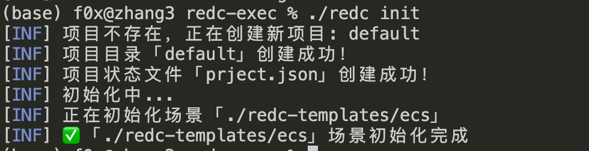
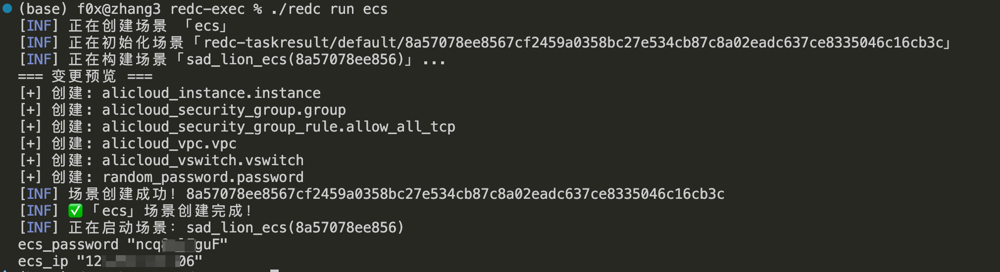
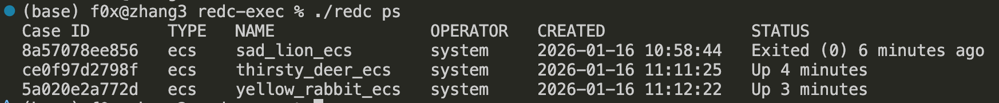

<p align="center">
  <a href="https://github.com/wgpsec/redc">
    
  </a>
  <p align="center">
    Red Team Infrastructure Multi-Cloud Automated Deployment Tool
    <br />
    <br />
<a href="https://github.com/wgpsec/redc/stargazers"></a>
<a href="https://github.com/wgpsec/redc/releases"></a>
<a href="https://github.com/wgpsec/redc/blob/main/LICENSE"></a>
<a href="https://github.com/wgpsec/redc/releases"></a>
<a href="https://goreportcard.com/report/github.com/wgpsec/redc"></a>
<a href="https://twitter.com/wgpsec"></a>
<br>
<br>
<a href="https://github.com/wgpsec/redc/discussions"><strong>Explore More Tricks »</strong></a>
    <br/>
    <br />
      <a href="https://github.com/wgpsec/redc?tab=readme-ov-file#quick-start">🧐How to Use</a>
      ·
    <a href="https://github.com/wgpsec/redc/releases">⬇️Download</a>
    ·
    <a href="https://github.com/wgpsec/redc/issues">❔Report Bug</a>
    ·
    <a href="https://github.com/wgpsec/redc/discussions">🍭Request Feature</a>
  </p>

[中文](README.md) | English

---

Redc is built on Terraform, further simplifying the complete lifecycle (create, configure, destroy) of red team infrastructure.

Redc is not just a machine provisioning tool, but an automated cloud resource scheduler!

- **One-command deployment**, from purchasing machines to running services, fully automated without manual intervention
- **Multi-cloud support**, compatible with Alibaba Cloud, Tencent Cloud, AWS and other mainstream cloud providers
- **Pre-configured scenarios**, red team environment ready-to-use templates, no more hunting for resources
- **State resource management**, locally saves resource state, destroy environments anytime, eliminate wasted resource costs

---

## Installation and Configuration

### redc Engine Installation
#### Download Binary Package

REDC download address: https://github.com/wgpsec/redc/releases

Download the compressed file for your system, extract it and run it from the command line.

#### HomeBrew Installation (WIP)

**Install**

```bash
brew tap wgpsec/tap
brew install wgpsec/tap/redc
```

**Update**

```bash
brew update
brew upgrade redc
```

### Template Selection

Scenario name - corresponds to template repository https://github.com/wgpsec/redc-template

Place them in your redc-templates path, the "folder name" is the scenario name when deploying

For specific usage and commands for each scenario, please check the readme of the specific scenario in the template repository https://github.com/wgpsec/redc-template

### Engine Configuration File

By default, redc reads the config.yaml configuration file in the current path, format as follows:
```yaml
# Multi-cloud credentials and default regions
providers:
  aws:
    access_key: "AKIDXXXXXXXXXXXXXXXX"
    secret_key: "WWWWWWWWWWWWWWWWWWWWWWWWWWWWWWWW"
    region: "us-east-1"
  aliyun:
    access_key: "AKIDXXXXXXXXXXXXXXXX"
    secret_key: "WWWWWWWWWWWWWWWWWWWWWWWWWWWWWWWW"
    region: "cn-hangzhou"
  tencentcloud:
    access_key: "AKIDXXXXXXXXXXXXXXXX"
    secret_key: "WWWWWWWWWWWWWWWWWWWWWWWWWWWWWWWW"
    region: "ap-guangzhou"
```

If the configuration file fails to load, it will attempt to read system environment variables, please configure them before use

---

## Quick Start

redc is designed with Docker-like commands

Use `redc -h` to view common command help

**Initialize Template**

Required for first-time use of templates. To speed up template deployment, it's recommended to run init after modifying `redc-templates` content to speed up subsequent deployments

````bash
redc init
````



> By default only Alibaba Cloud ECS single machine scenario is included, please add templates to the redc-templates path yourself

**List Template List**

```bash
redc image ls
```

**Create and Start Instance**

ecs is the template file name

````bash
redc create --name boring_sheep_ecs  [template_name] # Create an instance and plan (this process does not create the instance, just checks information)
# After create completes, it returns a caseid which can be used with the start command
redc start [caseid]
redc start [casename]
````

Directly create and start a case with template name ecs

```
redc run ecs
```



> After starting, it will provide a case id, which is the unique identifier for the scenario, required for subsequent operations
> For example, 8a57078ee8567cf2459a0358bc27e534cb87c8a02eadc637ce8335046c16cb3c can use 8a57078ee856 with the same effect

Use `-e` parameter to configure variables

```
redc run -e xxx=xxx ecs
```

Stop instance

````bash
redc stop [caseid] # Stop instance
redc rm [caseid] # Delete instance (confirm the instance is stopped before deleting)
redc kill [caseid] # After init template, stop and delete instance
````

![redc stop [caseid]](./img/image7.png)

**View case status**

````
redc ps
````



**Execute commands**

Directly execute command and return result

````
redc exec [caseid] whoami
````

![redc exec [caseid] whoami](./img/image3.png)

Enter interactive command mode

````
redc exec -t [caseid] bash
````

![redc exec -t [caseid] bash](./img/image4.png)

Copy files to server

```
redc cp test.txt [caseid]:/root/
```

![redc cp test.txt [caseid]:/root/](./img/image5.png)

Download files to local

```
redc cp [caseid]:/root/test.txt ./
```

![redc cp [caseid]:/root/test.txt ./](./img/image6.png)

**Change service**

This requires template support for changes, can switch elastic public IP

````
redc change [caseid]
````

## Compose Orchestration Service

redc provides an orchestration service

**Start orchestration service**

```
redc compose up
```

**Stop compose**

````
redc compose down
````

File name: `redc-compose.yaml`

**Compose Template**

```yaml
version: "3.9"

# ==============================================================================
# 1. Configs: Global Configuration Center
# Purpose: Define reusable static resources, redc will inject them into Terraform variables
# ==============================================================================
configs:
  # [File type] SSH public key
  admin_ssh_key:
    file: ~/.ssh/id_rsa.pub

  # [Structure type] Security group whitelist (will be serialized to JSON)
  global_whitelist:
    rules:
      - port: 22
        cidr: 1.2.3.4/32
        desc: "Admin Access"
      - port: 80
        cidr: 0.0.0.0/0
        desc: "HTTP Listener"
      - port: 443
        cidr: 0.0.0.0/0
        desc: "HTTPS Listener"

# ==============================================================================
# 2. Plugins: Plugin Services (Non-compute resources)
# Purpose: Cloud resources independent of servers, such as DNS resolution, object storage, VPC peering, etc.
# ==============================================================================
plugins:
  # Plugin A: Alibaba Cloud DNS resolution
  # Scenario: After infrastructure starts, automatically point domain to Teamserver IP
  dns_record:
    image: plugin-dns-aliyun
    # Reference externally defined provider name
    provider: ali_hk_main
    environment:
      - domain=redteam-ops.com
      - record=cs
      - type=A
      - value=${teamserver.outputs.public_ip}

  # Plugin B: AWS S3 storage bucket (Loot Box)
  # Scenario: Only enabled in production environment ('prod'), used to store returned data
  loot_bucket:
    image: plugin-s3
    profiles:
      - prod
    provider: aws_us_east
    environment:
      - bucket_name=rt-ops-2026-logs
      - acl=private

# ==============================================================================
# 3. Services: Case Scenarios
# ==============================================================================
services:

  # ---------------------------------------------------------------------------
  # Service A: Core Control End (Teamserver)
  # Features: Always starts (no profile), includes complete lifecycle hooks and file transfer
  # ---------------------------------------------------------------------------
  teamserver:
    image: ecs
    provider: ali_hk_main
    container_name: ts_leader

    # [Configs] Inject global configuration (tf_var=config_key)
    configs:
      - ssh_public_key=admin_ssh_key
      - security_rules=global_whitelist

    environment:
      - password=StrongPassword123!
      - region=ap-southeast-1

    # [Volumes] File upload (Local -> Remote)
    # Execute immediately after machine SSH is connected
    volumes:
      - ./tools/cobaltstrike.jar:/root/cs/cobaltstrike.jar
      - ./profiles/amazon.profile:/root/cs/c2.profile
      - ./scripts/init_server.sh:/root/init.sh

    # [Command] Instance internal auto-start
    command: |
      chmod +x /root/init.sh
      /root/init.sh start --profile /root/cs/c2.profile

    # [Downloads] File return (Remote -> Local)
    # Grab credentials after startup completes
    downloads:
      - /root/cs/.cobaltstrike.beacon_keys:./loot/beacon.keys
      - /root/cs/teamserver.prop:./loot/ts.prop

  # ---------------------------------------------------------------------------
  # Service B: Global Proxy Matrix (Global Redirectors)
  # Features: Matrix Deployment + Profiles
  # ---------------------------------------------------------------------------
  global_redirectors:
    image: nginx-proxy

    # [Profiles] Only start in specified mode (e.g., redc up --profile prod)
    profiles:
      - prod

    # [Matrix] Multiple Provider references
    # redc will automatically split into:
    # 1. global_redirectors_aws_us_east
    # 2. global_redirectors_tencent_sg
    # 3. global_redirectors_ali_jp (assuming this exists in providers.yaml)
    provider:
      - aws_us_east
      - tencent_sg
      - ali_jp

    depends_on:
      - teamserver

    configs:
      - ingress_rules=global_whitelist

    # Inject current provider's alias
    environment:
      - upstream_ip=${teamserver.outputs.public_ip}
      - node_tag=${provider.alias}

    command: docker run -d -p 80:80 -e UPSTREAM=${teamserver.outputs.public_ip} nginx-proxy

  # ---------------------------------------------------------------------------
  # Service C: Attack/Scan Nodes
  # Features: Attack mode specific
  # ---------------------------------------------------------------------------
  scan_workers:
    image: aws-ec2-spot
    profiles:
      - attack
    deploy:
      replicas: 5
    provider: aws_us_east
    command: /app/run_scan.sh

# ==============================================================================
# 4. Setup: Joint Orchestration (Post-Deployment Hooks)
# Purpose: After all infrastructure is Ready, execute cross-machine registration/interaction logic
# Note: redc will automatically skip related tasks for services not started based on currently activated Profile
# ==============================================================================
setup:

  # Task 1: Basic check (always execute)
  - name: "Check Teamserver status"
    service: teamserver
    command: ./ts_cli status

  # Task 2: Register AWS proxy (only effective in prod mode)
  # Reference split instance name: {service}_{provider}
  - name: "Register AWS proxy node"
    service: teamserver
    command: >
      ./aggressor_cmd listener_create 
      --name aws_http 
      --host ${global_redirectors_aws_us_east.outputs.public_ip} 
      --port 80

  # Task 3: Register Tencent proxy (only effective in prod mode)
  - name: "Register Tencent proxy node"
    service: teamserver
    command: >
      ./aggressor_cmd listener_create 
      --name tencent_http 
      --host ${global_redirectors_tencent_sg.outputs.public_ip} 
      --port 80

  # Task 4: Register Aliyun proxy (only effective in prod mode)
  - name: "Register Aliyun proxy node"
    service: teamserver
    command: >
      ./aggressor_cmd listener_create 
      --name ali_http 
      --host ${global_redirectors_ali_jp.outputs.public_ip} 
      --port 80

```

---

## Configure Cache and Acceleration

Configure cache address only:

```bash
echo 'plugin_cache_dir = "$HOME/.terraform.d/plugin-cache"' > ~/.terraformrc
```

Configure Alibaba Cloud acceleration, modify `~/.terraformrc` file

```
plugin_cache_dir  = "$HOME/.terraform.d/plugin-cache"
disable_checkpoint = true
provider_installation {
  network_mirror {
    url = "https://mirrors.aliyun.com/terraform/"
    # Restrict only Alibaba Cloud related Providers to download from domestic mirror source
    include = ["registry.terraform.io/aliyun/alicloud",
               "registry.terraform.io/hashicorp/alicloud",
              ]
  }
  direct {
    # Declare that except for Alibaba Cloud related Providers, other Providers keep original download link
    exclude = ["registry.terraform.io/aliyun/alicloud",
               "registry.terraform.io/hashicorp/alicloud",
              ]
  }
}
```

---

## Design Plan

1. Create a new project first
2. Creating a scenario under a specified project will copy a scenario folder from the scenario library to the project folder
3. Creating the same scenario under different projects will not interfere with each other
4. Creating the same scenario under the same project will not interfere with each other
5. Multiple user operations will not interfere with each other (local authentication is done, but this should actually be done on the platform)

- redc configuration file (.redc.ini)
- Project1 (./project1)
    - Scenario1 (./project1/[uuid1])
        - main.tf
        - version.tf
        - output.tf
    - Scenario2 (./project1/[uuid2])
        - main.tf
        - version.tf
        - output.tf
    - Project status file (project.ini)
- Project2 (./project2)
    - Scenario1 (./project2/[uuid1])
        - main.tf
        - version.tf
        - output.tf
    - Scenario2 (./project2/[uuid2])
        - ...
    - Project status file (project.ini)
- Project3 (./project3)
    - ...

## Article Introduction

- https://mp.weixin.qq.com/s/JH-IlL_GFgZp3xXeOFzZeQ
